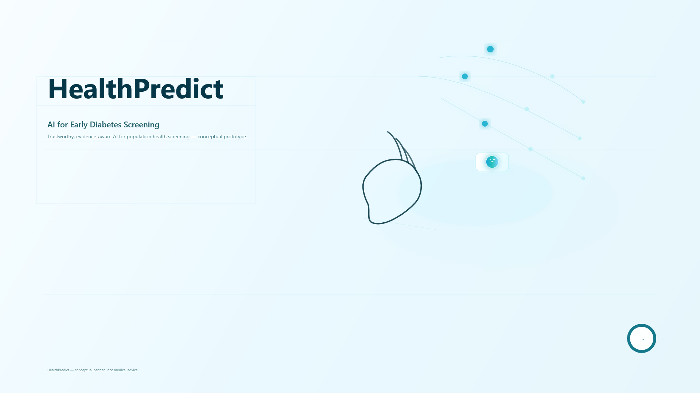

<!-- =============================== -->
<!--           BANNER               -->
<!-- =============================== -->

<p align="center">
  
</p>

<h1 align="center">🌍 HealthPredict: AI for Diabetes Risk Prediction (SDG 3)</h1>

<p align="center"><strong>Repository:</strong> ai-se-w02-core-concepts</p>

<!-- =============================== -->
<!--            BADGES               -->
<!-- =============================== -->

<p align="center">
  
  
  
  
  
  
</p>

The project implements a **binary classification model (Logistic Regression)** to predict the likelihood of Type 2 Diabetes using patient biometric data.
This work illustrates key **Week 2** learning objectives of the “AI for Software Engineering” specialization (Supervised Learning, Model Evaluation, Ethical Reflection).

---

## 🎯 Problem & SDG Alignment

Early detection of diabetes plays a vital role in prevention and treatment.  
Our AI model acts as a **low-cost, high-scale screening tool** to identify high-risk patients in resource-limited settings, directly contributing to global health improvement and reducing healthcare system burdens.

## 🤖 Machine Learning Approach 

| Component      | Detail                                                                 |
|----------------|-------------------------------------------------------------------------|
| **Dataset**    | Pima Indians Diabetes Dataset (`diabetes.csv`).                          |
| **Approach**   | Binary supervised classification (Diabetic / Non-Diabetic).              |
| **Model**      | Logistic Regression (`LogisticRegression`).                                                     |
| **Tech Stack** | Python, Pandas, NumPy, Scikit-learn, Matplotlib, Seaborn.                |

---

## 📂 Repository Structure

```bash
ai-se-w02-core-concepts/
├── src/
│   └── sdg3_health_predictor.py                  # Main Python ML script
├── data/
│   └── diabetes.csv                              # Project dataset (Input)
├── docs/
│   ├── SDG3_Report_Final.md                      # Summary Report
│   └── SDG3_HealthPredict_PitchDeck_2025.pdf     # Final Pitch Deck
├── assets/
│   ├── banner.png                                # Cover
│   └── confusion_matrix.png                      # Model evaluation plot
└── README.md                                     # Repository entry point (This file)
```

## ⚙️ Setup and Execution

### 1. Clone the Repository
```bash
git clone https://github.com/software-development-course-2025/ai-se-w02-core-concepts
cd ai-se-w02-core-concepts
```

### 2. Move Data File

Place the `diabetes.csv` file inside the **data/** folder.

### 3. Install Dependencies

```bash
pip install pandas numpy scikit-learn matplotlib seaborn
```

### 4. Run the ML Script

```bash
python src/sdg3_health_predictor.py
```

The script will print the evaluation metrics and display the Confusion Matrix plot.


## 📊 Model Results (Unseen Data)

The model was trained on **80%** and evaluated on **20%** of the data.

| Metric | Score (Example Output) |
|:------|:-----:|
| Accuracy | 0.7825 |
| Precision | 0.7011 |
| Recall | 0.6180 |
| F1-Score | 0.6572 |

### Confusion Matrix

The visualization below confirms the model's classification performance:  


## 💡 Ethical Reflection and Social Impact

The project highlights:

- Risks of **data bias**, as the dataset represents a limited population.
- Importance of **equity auditing** to ensure fair performance across diverse demographic groups.
- Necessity of **responsible AI practices**, transparency, and careful deployment in clinical environments.

These considerations align with SDG 3 by promoting **safe, ethical, and equitable health technology** development.

---

## ℹ️ Author & License

👤 Author: **Augusto Mate**  
📧 **Email:** mate.augusto.mz@gmail.com  
🐙 [GitHub](https://github.com/augusto-mate)   
🔗 [LinkedIn](https://linkedin.com/in/augusto-mate)

This project is licensed under the **MIT License**.  
See the [LICENSE](LICENSE) file for details.

---

> *In every dataset lies a story, and in every prediction, a chance to change one.  
> HealthPredict is a small step toward a future where care begins with foresight.*
