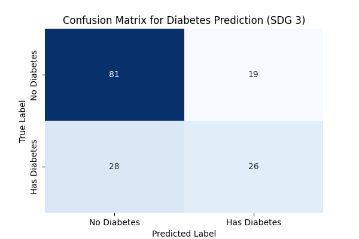

# **AI for Sustainable Development: Predicting Diabetes Risk (SDG 3)**  
**Project Repository:** `ai-se-w02-core-concepts`

## **1. SDG Problem Addressed**

The third Sustainable Development Goal (SDG 3) aims to *ensure healthy lives and promote well-being for all at all ages*, with Target **3.4** focusing on reducing premature mortality from non-communicable diseases (NCDs).  
Diabetes is a major chronic NCD, and early detection is essential to prevent long-term complications.

**Problem Statement:**  
In resource-constrained environments, early screening and risk assessment are critical to preventing the onset and progression of Type 2 Diabetes. Artificial Intelligence enables a scalable and low-cost solution, especially where access to medical professionals is limited.

## **2. Machine Learning Approach**

This project frames diabetes prediction as a **Supervised Classification** problem, where the model learns to map patient features to a binary outcome (Diabetic / Non-Diabetic).

### **Components Overview**

| Component     | Detail                                                                 | Rationale                                                                                     |
|--------------|-------------------------------------------------------------------------|-----------------------------------------------------------------------------------------------|
| **Dataset**  | Pima Indians Diabetes Dataset (biometrics, glucose levels, BMI, age…)    | Widely used benchmark dataset for public health classification tasks.                        |
| **Preprocessing** | Mean imputation for invalid zeros; feature scaling with StandardScaler | Handles missing values and ensures homogeneous feature scales, aiding Logistic Regression.     |
| **Model**    | Logistic Regression                                                     | Efficient, interpretable, and reliable for high-stakes binary classification.                 |
| **Workflow** | 80% Training / 20% Testing split                                        | Ensures robust evaluation on unseen data according to ML best practices.                     |

## **3. Results and Model Performance**

Model performance was evaluated on the test set using clinically relevant metrics:

| Metric      | Score (Example) | Interpretation |
|-------------|-----------------|----------------|
| **Accuracy** | *0.7825* | Correctly classified 78.25% of all cases. |
| **Precision** | *0.7011* | 70.11% of predicted Diabetic cases were true positives (controls False Positives). |
| **Recall** | *0.6180* | Identified 61.80% of actual Diabetic cases (minimizes missed detections). |
| **F1-Score** | *0.6572* | Balanced mean of precision and recall. |

The confusion matrix (see figure below) highlights the distribution of True Positives, False Negatives, and other key evaluation components, confirming the model's generalization ability and inherent trade-offs.

>   
> <em>Figure 1 — Confusion Matrix of the Logistic Regression Model</em>

## **4. Ethical and Social Considerations**

### **Bias and Fairness**
The dataset originates from a single ethnic group, which introduces a risk of **data bias**.  
A model trained on limited demographic diversity may underperform on broader populations, potentially reinforcing healthcare inequalities.

### **SDG Impact and Sustainability**
This AI-driven solution directly supports **SDG 3**—specifically Target **3.4**—by enabling scalable early-risk assessment.

To ensure ethical, sustainable deployment:

- Continuous monitoring of model performance across diverse demographic groups.
- Retraining with geographically and ethnically diverse data before real-world use.
- Transparent communication of the model’s limitations to clinicians and decision-makers.

## **5. Conclusion**

This project demonstrates how classical machine learning methods can support **early diabetes risk prediction**, contributing to SDG 3 through scalable and equitable healthcare innovation.

